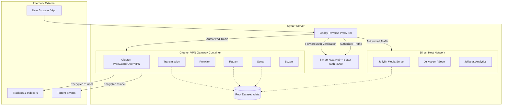

# ⚡ Synarr

<p align="center">
  <strong>The Turnkey, VPN-Secured <code>*arr</code> & Media Streaming Suite with Unified Authentication Hub</strong>
</p>

<p align="center">
  
  
  
  
  
</p>

---

**Synarr** is a production-ready, fully automated, self-hosted media center. It brings together the complete **Servarr** ecosystem (`Radarr`, `Sonarr`, `Prowlarr`, `Bazarr`, `Overseerr/Seerr`), a torrent client (`Transmission`), an analytics engine (`Jellystat`), and a streaming server (`Jellyfin`), all unified behind a **custom Nuxt-powered SSO Hub with 2FA** and secured via a **Gluetun VPN Sidecar**.

---

## 🏗️ Architecture



### Key Highlights

* 🛡️ **Sidecar VPN Gateway**: All acquisition and indexer containers share the network stack of Gluetun (`network_mode: "container:vpn"`). If the VPN drops, all torrent/search traffic immediately halts (built-in killswitch).
* 🔐 **Unified Authentication (SSO)**: Every `*arr` web UI is guarded behind Caddy `forward_auth` powered by the **Synarr Hub** (built with Nuxt 3, Better-Auth, and 2FA / TOTP support).
* ⚡ **Atomic Hardlinks**: A unified single-root dataset (`/data`) allows instant, zero-duplicate moves between downloading (`torrents/`) and your organized streaming library (`media/`).
* 📱 **Progressive Web App (PWA)**: Access and switch between all services on desktop or mobile through the unified Synarr interface.

---

## 🧩 Included Services

| Service | Role | Network Mode |
| :--- | :--- | :--- |
| **Gluetun** | VPN gateway & encrypted killswitch tunnel | Direct (Exposes web ports) |
| **Transmission** | BitTorrent downloader | Routed via VPN sidecar |
| **Prowlarr** | Torrent indexer & tracker manager | Routed via VPN sidecar |
| **Radarr** | Movie library automation & manager | Routed via VPN sidecar |
| **Sonarr** | TV show series automation & manager | Routed via VPN sidecar |
| **Bazarr** | Subtitle downloader & manager | Routed via VPN sidecar |
| **Seerr** | Media discovery & request manager | Host / Direct |
| **Jellyfin** | Personal media player & streaming server | Host / Direct |
| **Jellystat** | Jellyfin analytics & watch statistics | Host / Direct |
| **Synarr Hub** | Unified dashboard, module launcher & 2FA Auth | Host / Direct |
| **Caddy** | Reverse proxy with SSO forward-authentication | Host / Direct |

---

## 📂 Storage Structure & Hardlinks

To avoid wasting disk space and eliminate slow file copies across filesystems, Synarr uses a **Single Root Dataset** (`/data`):

```text
data/
├── torrents/                  # In-progress & seeding files
│   ├── movies/
│   └── tv/
└── media/                     # Formatted library (Jellyfin source)
    ├── movies/
    └── tv/
docker-config/                 # Persistent service configurations
    ├── vpn/
    ├── transmission/
    ├── radarr/
    ├── sonarr/
    ├── prowlarr/
    ├── bazarr/
    ├── seerr/
    └── hub/
```

> [!TIP]
> Because `./data` is mounted to `/data` across all containers, Radarr and Sonarr create **hardlinks** from `torrents/` to `media/`. Files remain seeding without taking twice the disk space.

---

## 🚀 Quick Start

### 1. Clone the repository

```bash
git clone https://github.com/<your-username>/synarr.git
cd synarr
```

### 2. Prepare directories

Create required persistent data and configuration directories:

```bash
chmod +x ./bin/create-folder-structure.sh
./bin/create-folder-structure.sh
```

### 3. Configure your VPN

Place your OpenVPN (`client.conf` or `.ovpn`) or WireGuard configuration inside:

```text
docker-config/vpn/
```

*(Refer to [Gluetun documentation](https://github.com/qdm12/gluetun-wiki) for provider-specific environment variables in `docker-compose.yaml` if needed).*

### 4. Deploy

```bash
docker compose up -d
```

---

## 📡 Accessing Services

Once deployed, access the **Synarr Hub** at `http://<your-server-ip>`:

* **Initial Setup**: Navigate to `http://<your-server-ip>/register` to create your single admin account and enable 2FA / OTP.
* **Unified Hub**: After signing in, you can access all services directly through the sidebar launcher or at their individual sub-paths:
  * `/radarr` — Movies
  * `/sonarr` — Series
  * `/prowlarr` — Indexers
  * `/transmission` — BitTorrent Client
  * `/bazarr` — Subtitles
  * `/seerr` — Requests
  * `/jellystat` — Stats
  * `http://<your-server-ip>:8096` — Jellyfin Direct Streaming

---

## 🛡️ Killswitch Verification

To ensure your downloader traffic is fully routed through the VPN tunnel and not leaking your real ISP address:

```bash
docker exec transmission curl https://ifconfig.me
```

*The returned IP address must match your VPN provider's exit node, not your home IP.*

---

## 📜 License

Distributed under the [MIT License](LICENSE).
